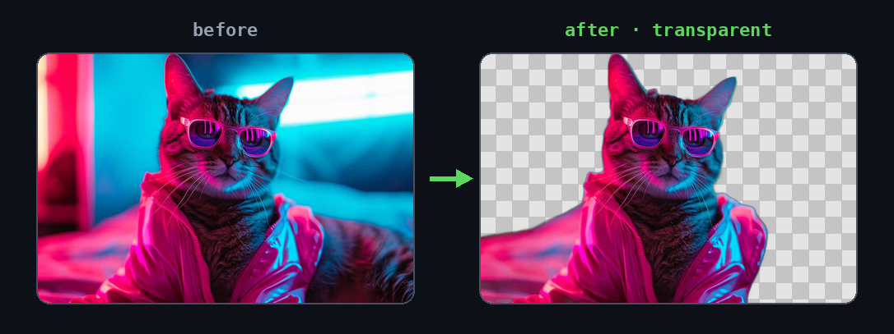
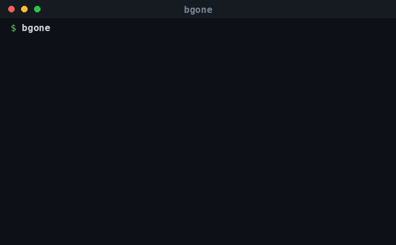
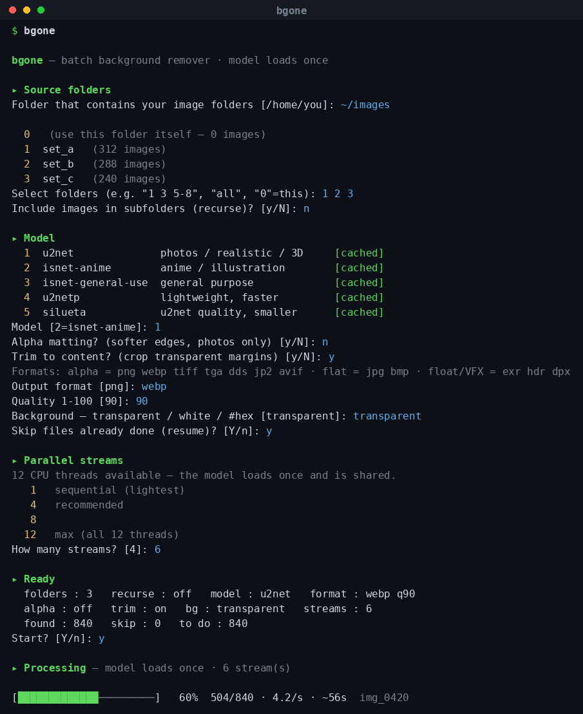

# bgone

[](https://github.com/suloto/bgone/actions/workflows/ci.yml)

A friendly, **pure-terminal** batch background remover — built on
[rembg](https://github.com/danielgatis/rembg).

Point it at folders of images and it strips their backgrounds to transparent PNGs.





<details>
<summary>Full interactive flow</summary>



</details>

## Features
- **Bulk multi-folder select** — numbered picklist (`1 3 5-8`, `all`, `0`=this folder), with optional **recurse** into subfolders
- **Per-folder output** — each `FOLDER` → a sibling `FOLDER _bgone` (subfolder tree mirrored when recursing)
- **Loads the model once** and processes N images in parallel ("streams") — one model in RAM
- **Trim to content** — crop each cutout to the subject's bounding box
- **Background** — keep it transparent, or composite onto white / black / a custom `#hex`
- **Live progress** — bar with throughput + ETA, plus a pass/fail summary
- **Remembers your last settings** (model, streams, options)
- **Tab-completion** for the `bgone` command and the folder prompt
- **GPU-ready** — uses a hardware execution provider if onnxruntime exposes one, else CPU
- Models (menu order): `u2net`, `isnet-anime`, `isnet-general-use`, `u2netp`, `silueta`

## Install
**Requirements:** Linux, Python 3.9+, and `sudo`. (Debian/Ubuntu also need `python3-venv`; on RHEL/Rocky/Alma it's built in.)
```bash
sudo ./install.sh                 # installs to /opt/bgone
# or pick a location:
sudo PREFIX=/opt/myplace ./install.sh
```
Creates a Python venv, installs `rembg` (versions pinned via `constraints.txt`), drops in the tool, and registers the `bgone` command + bash completion. The installer is **idempotent** (re-run it to upgrade in place) and **won't overwrite** an unrelated `/usr/local/bin/bgone` unless you pass `BGONE_FORCE=1`.

**GPU:** the installer **auto-detects** an NVIDIA GPU and installs the GPU runtime, else CPU. Force it with `sudo BGONE_GPU=gpu ./install.sh` (or `BGONE_GPU=cpu`). At runtime bgone prints which ONNX execution provider it actually used, so you can confirm GPU vs CPU per machine.

**Fleet / production:** versions are pinned in `constraints.txt` so every workstation runs identical, vetted packages, and you can verify model-weight integrity on any machine with `bgone --verify-models` (checks the cached `.onnx` files against the shipped `models.sha256`).

## Usage
```bash
bgone                    # interactive: pick folders, model, options
bgone /path/to/images    # run directly on one or more folders
bgone i in.png out.png   # passthrough to the underlying rembg CLI
bgone --verify-models    # check cached model weights vs the shipped checksums
bgone --help
```

## Uninstall
```bash
sudo ./uninstall.sh            # from the cloned repo
sudo /opt/bgone/uninstall.sh   # or the installed copy — no repo needed
sudo bgone --uninstall         # or straight from the command
```
Removes the venv, the `bgone` command, bash completion, and the downloaded models under `/opt/bgone`. Add `-y` to skip the confirmation; per-user settings in `~/.config/bgone` are left in place.

## Models
Each model's ONNX weights are downloaded from upstream the first time you use it, then
cached and reused offline. By default `bgone` keeps them in a shared `models/` folder
next to the install (`$PREFIX/models`, made world-writable so every user populates the
same cache instead of re-downloading per home). Set `U2NET_HOME` to point elsewhere
(e.g. the classic `~/.u2net`). Each model carries its **own** upstream license — check
those before redistributing weights or using output commercially.

## Credits & license
Built on **[rembg](https://github.com/danielgatis/rembg)** by Daniel Gatis (MIT).
`bgone` is released under the MIT License — see [LICENSE](./LICENSE).
